<div align="center">
  <a href="https://community.obsidian.md/plugins/advanced-multi-column" target="_blank">
    
  </a>
</div>

<div align="center">

# Advanced Multi Column

Create interactive, nested multi-column layouts — without losing sibling columns when editing in Live Preview.

</div>

<p align="center">
  
</p>


<p align="center">
  <a href="https://github.com/amatya-aditya/advanced-multi-column/releases/latest">
    
  </a>
  <a href="https://github.com/amatya-aditya/advanced-multi-column/blob/main/LICENSE">
    
  </a>
  
  <a href="https://community.obsidian.md/plugins/advanced-multi-column">
    
  </a>
</p>

<p align="center">
  <a href="https://community.obsidian.md/plugins/advanced-multi-column"><strong>Install from Obsidian Community Plugins</strong></a>
</p>

<p align="center">
  <a href="#features">Features</a> &bull;
  <a href="./docs/releases/usage.md">Usage</a> &bull;
  <a href="./docs/releases/legacy-usage.md">Legacy Usage</a> &bull;
  <a href="#quick-start">Quick Start</a> &bull;
  <a href="#syntax-reference">Syntax</a> &bull;
  <a href="#installation">Installation</a> &bull;
  <a href="#troubleshooting">Troubleshooting</a>
</p>

## Why this plugin?

The problem with existing multi-column plugin? In **Live Preview**, when you click into one column to edit it, Obsidian collapses the entire block — **sibling columns disappear**, replaced by raw markup. You lose all visual context of the layout while editing.

**Advanced Multi Column** fixes this. 
It uses lightweight comment markers (`%% col-start %%`, `%% col-break %%`, `%% col-end %%`) instead of wrapping content in a single callout or codeblock. 
This means when you edit one column, **the other columns stay rendered**. 
You always see the full layout, making multi-column editing feel natural instead of fighting the editor.


## Features

- **Marker-based syntax** — `%% col-start %%`, `%% col-break %%`, `%% col-end %%`
- **Live Preview + Reading View** — renders in both modes, toggleable independently
- **Nested columns** — columns inside columns, unlimited depth
- **Drag to reorder** — grab handle or Alt+drag to rearrange columns
- **Resize by dragging** — drag the vertical divider between columns
- **Right-click style popover** — per-column and container styling
- **Inline editing** — click to edit with live markdown preview
- **Wikilink autocomplete** — `[[` triggers file suggestions inside column editors
- **Image paste** — paste images to auto-save and insert `![[image.png]]`
- **Colored column headers** — start a column with `!tip: Title` for a colored header bar with an icon; built-in `note`, `info`, `tip`, `warning` and `danger` types, plus your own custom types (icon, background, text color, size, weight)
- **PDF export** — **Export to PDF** keeps your column layout, styles and headers instead of flattening them
- **Style tokens** — portable styling via marker parameters (`b:`, `bc:`, `t:`, `sb:`, `hd:`)
- **Quick add/remove** — `+` / `x` buttons in each column header
- **Global settings** — default layout, colors, borders, dividers
- **MOC (map of content)** — auto-updating columns of links to notes from a folder, tags or properties, grouped into columns you choose

## Screenshots

<table>
  <tr>
    <td width="50%" valign="top">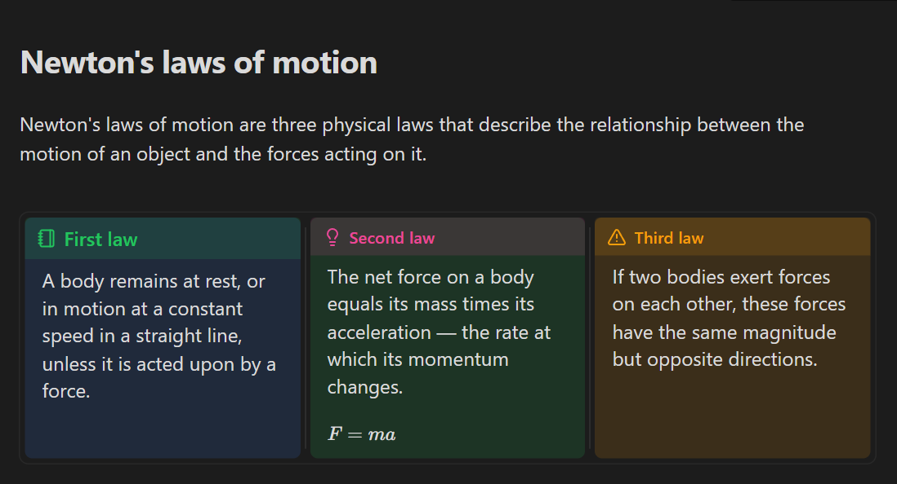<br><sub>Column headers and coloured backgrounds</sub></td>
    <td width="50%" valign="top">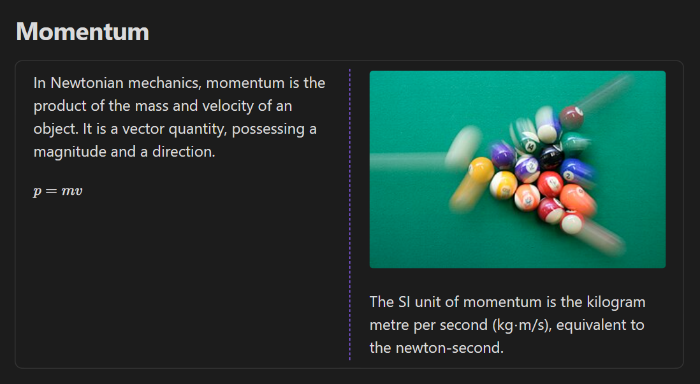<br><sub>Dashed separator between columns</sub></td>
  </tr>
  <tr>
    <td width="50%" valign="top">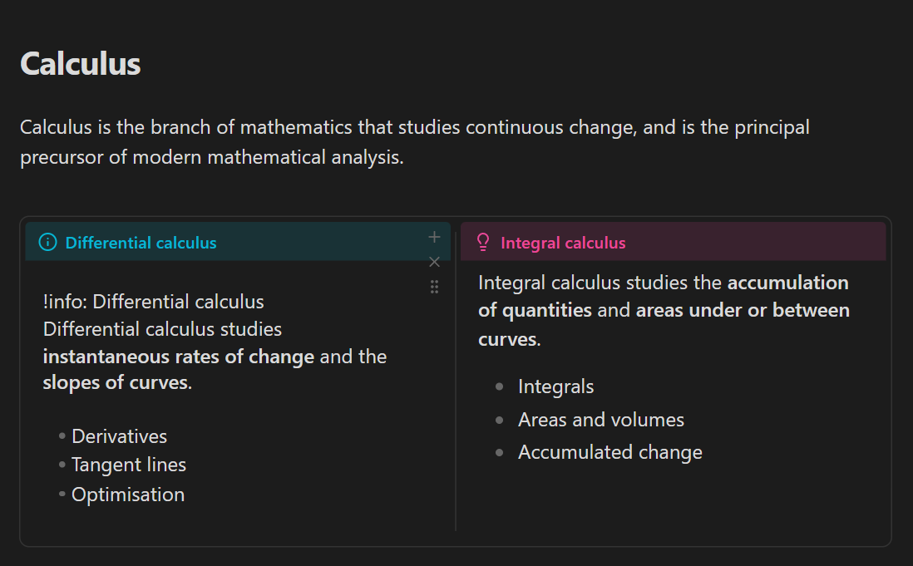<br><sub>Editing a column in place — the other columns stay rendered</sub></td>
    <td width="50%" valign="top">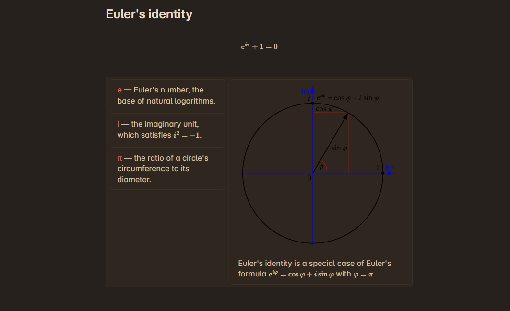<br><sub>Stacked rows beside a wide column</sub></td>
  </tr>
  <tr>
    <td width="50%" valign="top">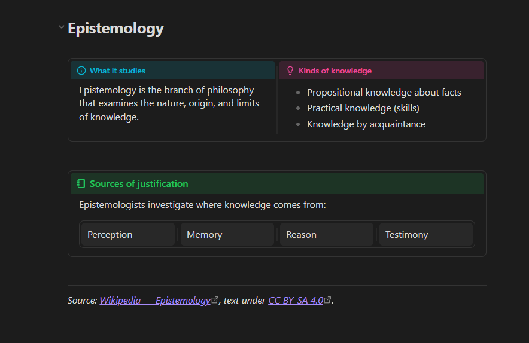<br><sub>Coloured column headers with icons</sub></td>
    <td width="50%" valign="top">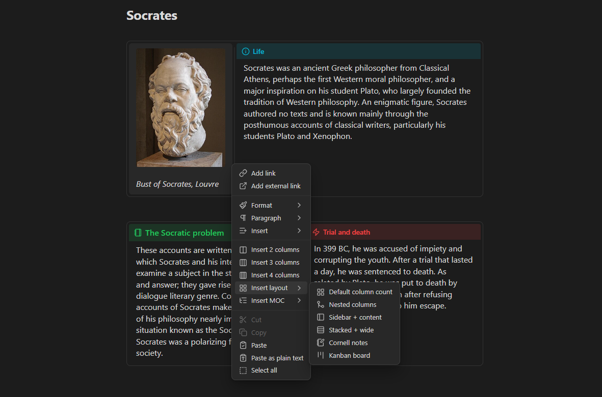<br><sub>Right-click → Insert layout: ready-made layouts</sub></td>
  </tr>
  <tr>
    <td width="50%" valign="top">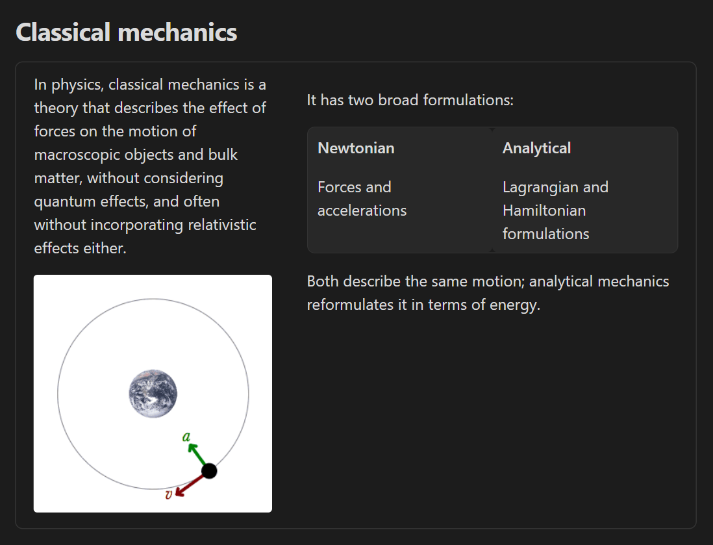<br><sub>Nested (child) columns</sub></td>
    <td width="50%" valign="top">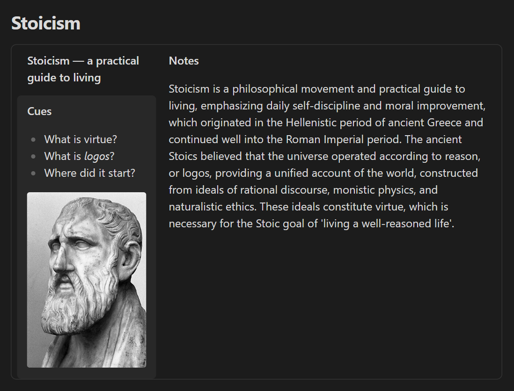<br><sub>Cornell notes layout</sub></td>
  </tr>
  <tr>
    <td width="50%" valign="top">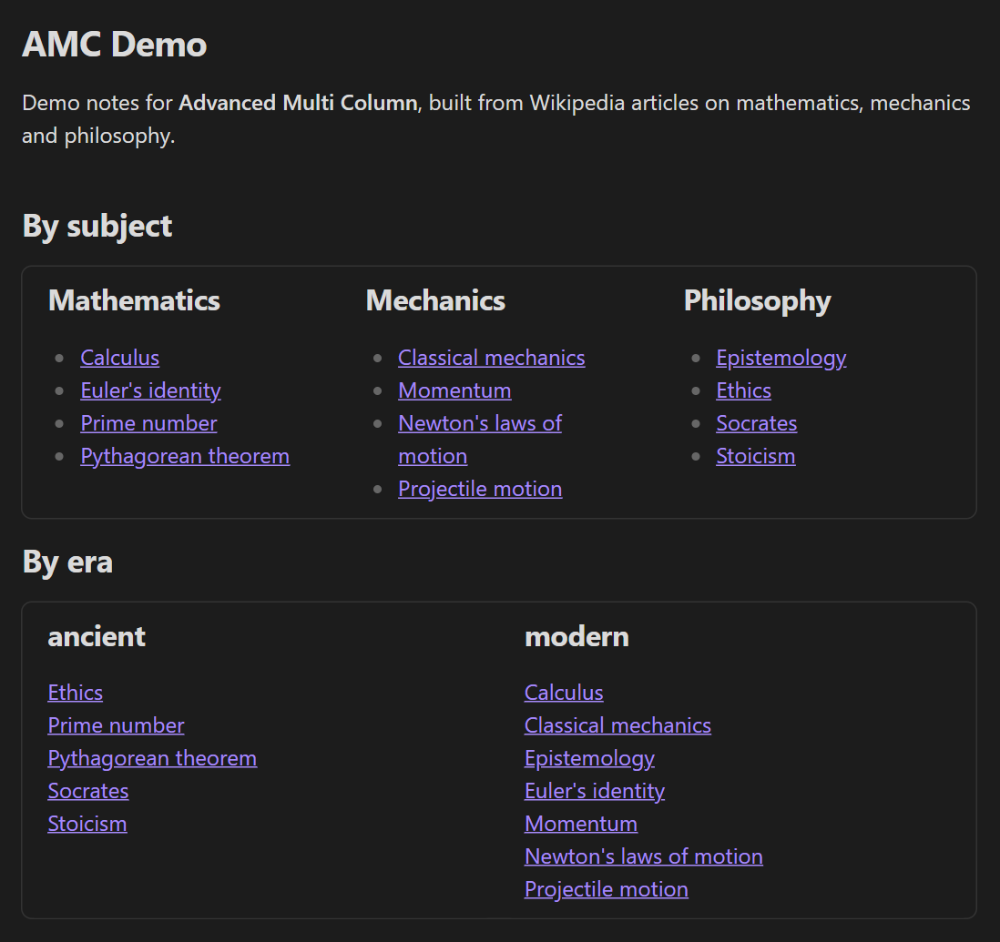<br><sub>MOC: auto-updating map of notes, by subfolder and by property</sub></td>
    <td width="50%" valign="top">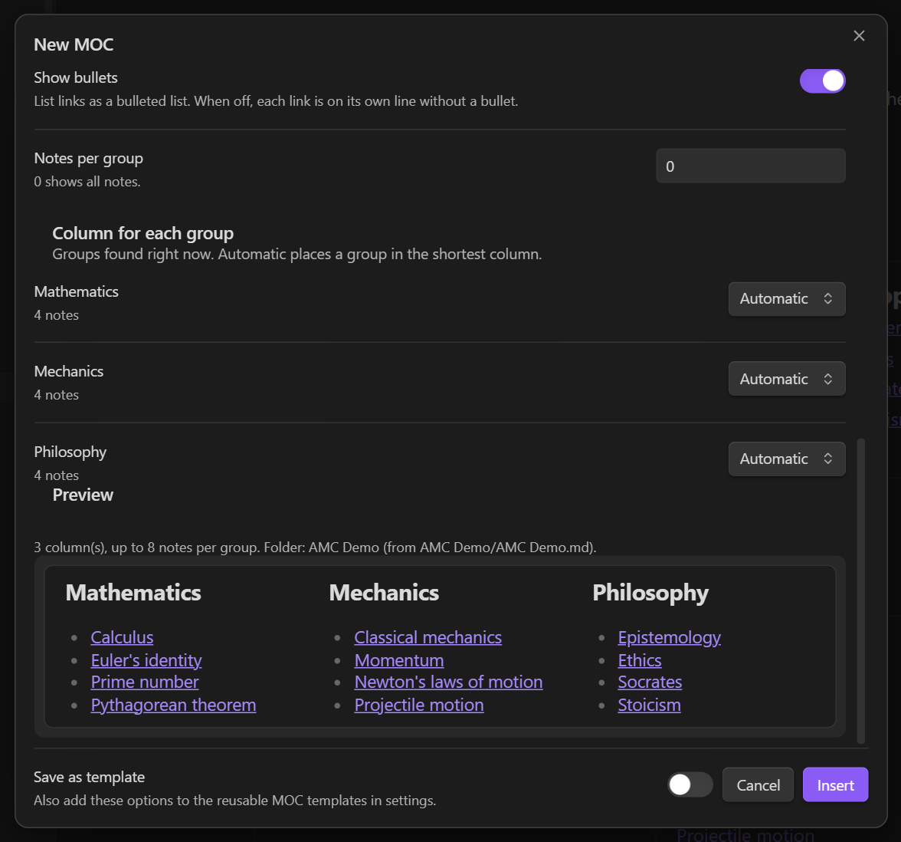<br><sub>New MOC dialog with a live preview</sub></td>
  </tr>
  <tr>
    <td width="50%" valign="top">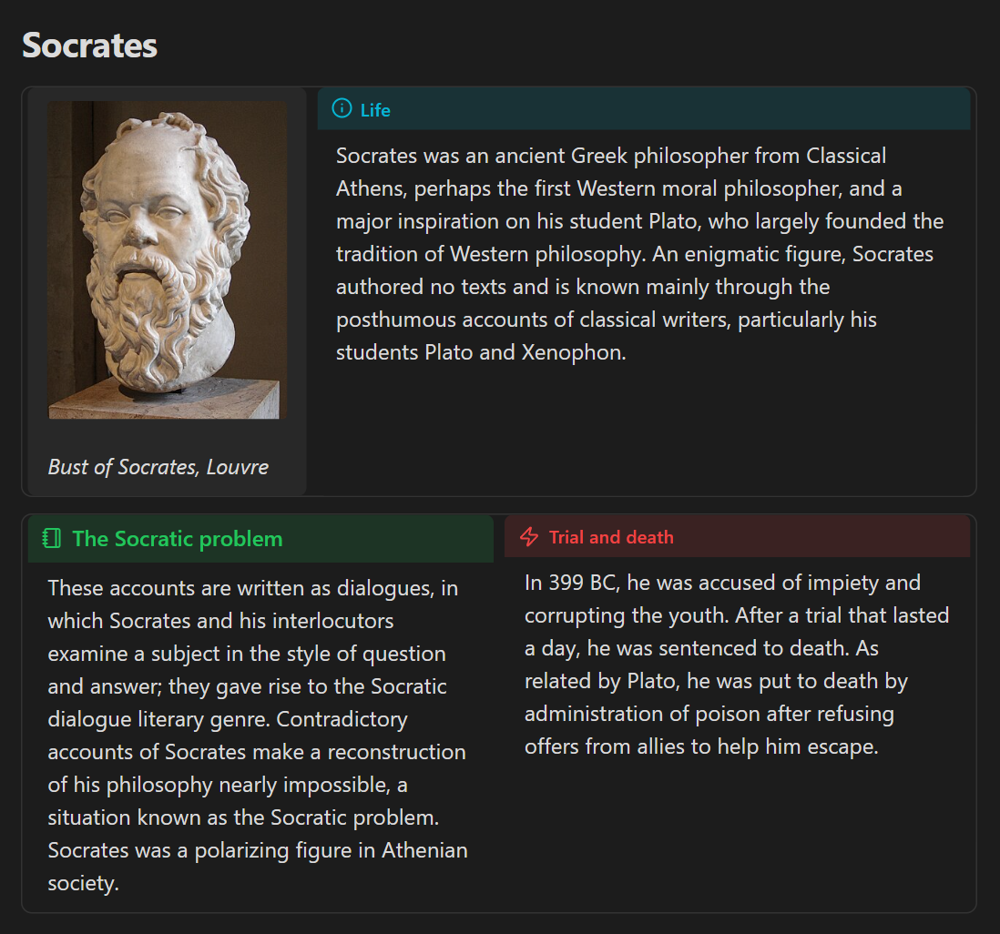<br><sub>Sidebar with an image, headers in Reading view</sub></td>
    <td width="50%" valign="top">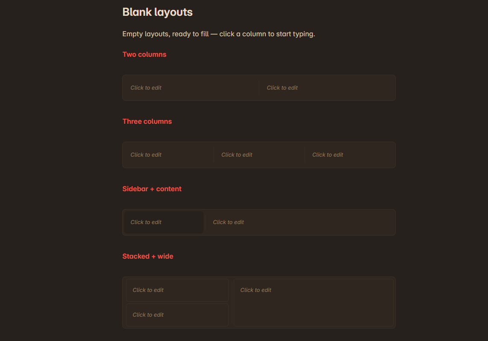<br><sub>Blank layouts, ready to fill</sub></td>
  </tr>
  <tr>
    <td width="50%" valign="top">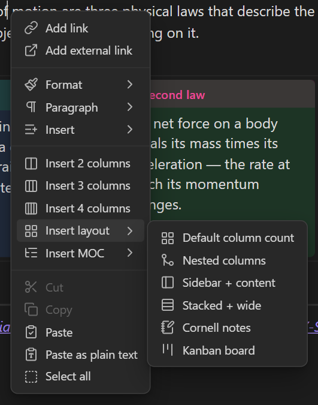<br><sub>Right-click in a note: insert columns, layouts and MOCs</sub></td>
    <td width="50%" valign="top">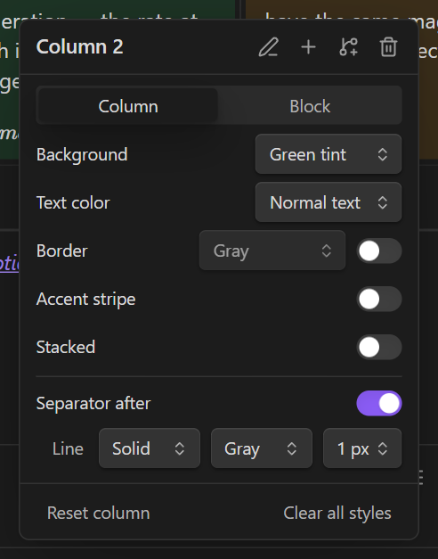<br><sub>Right-click a column: style it, add, edit or delete</sub></td>
  </tr>
  <tr>
    <td colspan="2" align="center">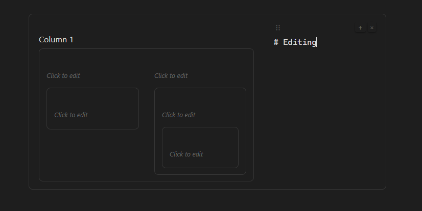<br><sub>Nested blank columns — edit one while the rest stay rendered</sub></td>
  </tr>
</table>

<sub>Demo notes use text from Wikipedia (CC BY-SA 4.0) and images from Wikimedia Commons (each under its own free licence; see the linked articles).</sub>


## Quick Start

1. Open the command palette and run **Insert 2-wide layout**, or right-click in the editor and select **Insert Column Layout** from the context menu.
2. Click inside each column preview area to edit.
3. Drag the vertical divider between columns to resize.
4. Right-click a column to open style options.

### Basic syntax

```md
%% col-start %%
%% col-break %%
Left column content
%% col-break %%
Right column content
%% col-end %%
```

> Content between `%% col-start %%` and the first `%% col-break %%` is ignored.

## Syntax Reference

Markers must be on their own lines.

### Container markers

| Marker | Purpose |
|--------|---------|
| `%% col-start %%` | Start a column block |
| `%% col-end %%` | End a column block |

`col-start` accepts optional container style tokens:

```md
%% col-start:b:secondary,bc:accent,sb:1 %%
```

### Column markers

| Marker | Purpose |
|--------|---------|
| `%% col-break %%` | Start a new column (equal width) |
| `%% col-break:40 %%` | Start a column at 40% width |
| `%% col-break:w:40 %%` | Explicit width form |

Width and style tokens can be combined:

```md
%% col-break:35,b:blue-soft,bc:blue,t:text,sb:1 %%
```

### Style tokens

| Token | Property | Values |
|-------|----------|--------|
| `b:` | Background | `transparent`, `primary`, `secondary`, `alt`, `accent-soft`, `red-soft`, `orange-soft`, `yellow-soft`, `green-soft`, `cyan-soft`, `blue-soft`, `pink-soft` |
| `bc:` | Border color | `gray`, `accent`, `muted`, `text`, `red`, `orange`, `yellow`, `green`, `cyan`, `blue`, `pink` |
| `t:` / `tc:` | Text color | Same as border color |
| `sb:` | Show border | `1`/`0`, `true`/`false`, `yes`/`no`, `on`/`off` |
| `h:` / `hd:` | Horizontal dividers | Same as show border |

## Nested Layout Example

```md
%% col-start %%
%% col-break:40 %%
# Column 1
Top-level content.
%% col-break:60 %%
# Parent column
This column contains nested columns.

%% col-start %%
%% col-break %%
## Child column 1
Nested content.
%% col-break %%
## Child column 2
Nested content.
%% col-end %%
%% col-end %%
```

## Commands

| Command | Description |
|---------|-------------|
| Insert 2-wide layout | Two equal columns |
| Insert 3-wide layout | Three equal columns |
| Insert 4-wide layout | Four equal columns |
| Insert layout (custom count) | Uses default count from settings |
| Insert nested layout | Parent with child columns template |

## Editing

- **Click** preview content to enter edit mode
- **Tab** / **Shift+Tab** — indent/unindent list items, or cycle through columns
- **Esc** — commit and exit edit mode
- **`[[`** — wikilink suggestions
- **Ctrl/Cmd+B** — bold, **Ctrl/Cmd+I** — italic
- **Paste image** — auto-saves and inserts `![[...]]`
- **Drag handle** or **Alt+drag** — reorder columns
- **`+`** — add column, **`x`** — remove column

## Right-Click Style Popover

Right-click any column to:
- Style current column (background, border, text, toggles)
- Style parent container
- Add column / add child column
- Reset styles (column or parent)
- Clear all styles recursively

## Settings

**Settings → Community Plugins → Advanced Multi Column**

- **General** — enable/disable live preview and reading view, default column count, minimum column width, drag handles
- **MOC** — reusable MOC templates: sources (a fixed folder or the note's own folder, tags, properties), grouping, columns, and a live preview
- **Column headers** — turn column headers on or off, edit the built-in header types and add your own
- **Appearance** — style target (all or specific column), container background/border/radius/text, vertical and horizontal divider configuration

## MOC (map of content)

A MOC lists notes as links in columns and keeps itself up to date. Right-click in a note and choose **Insert MOC → New MOC…**: pick the folder (by default the note's own folder, with its subfolders as columns), tags and/or properties from your vault, see a live preview, and insert. Save options you reuse as templates in **Settings → Advanced Multi Column → MOC**; right-click a MOC → **Edit MOC** to change it later.

The links are written into the note, so they show in graph view and backlinks. When notes are added, renamed, deleted or retagged, the MOC updates automatically. See the [MOC guide](https://github.com/amatya-aditya/advanced-multi-column/wiki/10-moc-map-of-content) for details.

## Privacy and vault access

Advanced Multi Column works entirely offline: it makes no network requests and collects no data.

What it accesses, and why:

- **Notes you open** are read to render columns in Reading view and when exporting to PDF.
- **The list of notes and their metadata** (file paths, tags, properties — from Obsidian's metadata cache) is used only by **MOC** to find the notes a MOC lists. MOC can be turned off in **Settings → Advanced Multi Column → MOC**.
- **Notes are written** only when you edit columns, insert a layout or MOC, or when an inserted MOC updates its own list of links.
- **Pasted images** in a column editor are saved in the note's folder; pasting reads only what you paste.

## Installation

### Community plugins (recommended)

Advanced Multi Column is in the official Obsidian community plugin list.

- **Open in Obsidian:** [https://community.obsidian.md/plugins/advanced-multi-column](https://community.obsidian.md/plugins/advanced-multi-column) — select **Install** there. To jump straight to the plugin inside Obsidian instead, paste this link into your browser's address bar:

  ```
  obsidian://show-plugin?id=advanced-multi-column
  ```

- **Or from inside Obsidian:**
  1. Open **Settings → Community plugins**.
  2. Turn off **Restricted mode** if it is on.
  3. Select **Browse** and search for **Advanced Multi Column**.
  4. Select **Install**, then **Enable**.

Updates arrive through **Settings → Community plugins → Check for updates**.

### Beta versions with BRAT

1. Install the [BRAT plugin](https://github.com/TfTHacker/obsidian42-brat) if you haven't already.
2. Open **Settings → BRAT → Add Beta Plugin**.
3. Enter `https://github.com/amatya-aditya/advanced-multi-column` and click **Add Plugin**.
4. Enable **Advanced Multi Column** in **Settings → Community Plugins**.

### Manual

1. Download `main.js`, `manifest.json`, and `styles.css` from the [latest release](https://github.com/amatya-aditya/advanced-multi-column/releases).
2. Create folder: `.obsidian/plugins/advanced-multi-column/`
3. Copy the files into that folder.
4. Reload Obsidian and enable the plugin.


## Legacy Syntax

CSS for older callout-based layouts (`[!col]` / `[!col-md-*]`) is supported. Marker syntax is recommended for new notes for extended features.

Use nested sibling callouts in this format:

```md
> [!col]
> > [!col-md]
> > Left column
>
> > [!col-md]
> > Right column
```

If `[!col-md]` appears as plain text, the nested callout structure is malformed.

## Development

```bash
npm install
npm run dev      # watch mode
npm run build    # production
```

## Other Plugins

- [RSS Dashboard](https://github.com/amatya-aditya/obsidian-rss-dashboard)
- [Media Slider](https://github.com/amatya-aditya/obsidian-media-slider)
- [Zen Space](https://github.com/amatya-aditya/obsidian-zen-space)

## Support

If you find this plugin useful, consider supporting development:

<p align="center">
  <a href="https://www.buymeacoffee.com/amatya_aditya" target="_blank">☕ Buy me a coffee</a>
  &nbsp;&nbsp;&bull;&nbsp;&nbsp;
  <a href="https://ko-fi.com/Y8Y41FV4WI" target="_blank">Ko-fi</a>
  &nbsp;&nbsp;&bull;&nbsp;&nbsp;
  <a href="https://discord.gg/9bu7V9BBbs" target="_blank">Discord</a>
</p>

## Privacy

This plugin runs locally in your vault and does not include telemetry.
